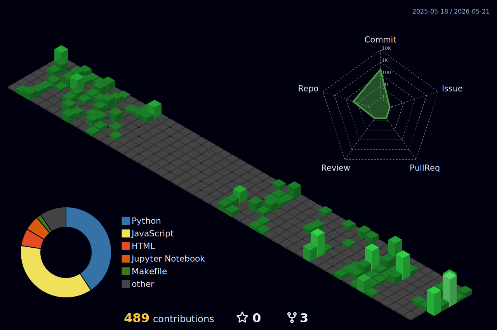

<h1 align="center">Hey there 👋, I'm Prateek Agrahari</h1>

<h3 align="center">
Full Stack Developer 💻 | Aspiring Data Analyst 📊
</h3>

---

## 👨‍💻 About Me

I’m a Full Stack Developer with a growing passion for **Data Analytics and Data-Driven Systems**.  
I enjoy working across the stack while building strong analytical foundations.

- Strong grasp of **NumPy, Pandas, SQL & DBMS**
- Regular problem solver on **LeetCode, GFG & Codeforces**
- Interested in backend systems and data analysis workflows
- Currently transitioning deeper into Data Analytics

---

## 🛠 Tech Stack

### 🌐 Full Stack Development

  

### 📊 Data & Programming

  

- Libraries: **NumPy, Pandas**
- Database: **SQL, DBMS Concepts**

<!--- --- --->

<!-- <h2 align="center">📊 Contribution Activity</h2> -->

<!-- 

  

 -->
<!---  --->

<!--- --- --->
---

## 📊 Contribution Activity

  

---

## ⚡ LeetCode Stats

  

---
<h2 align="center">🌐 Connect with Me</h2>

  
  
  
  

<!--  -->

**✨"Designing intelligent systems with code, data, and curiosity" ✨**

